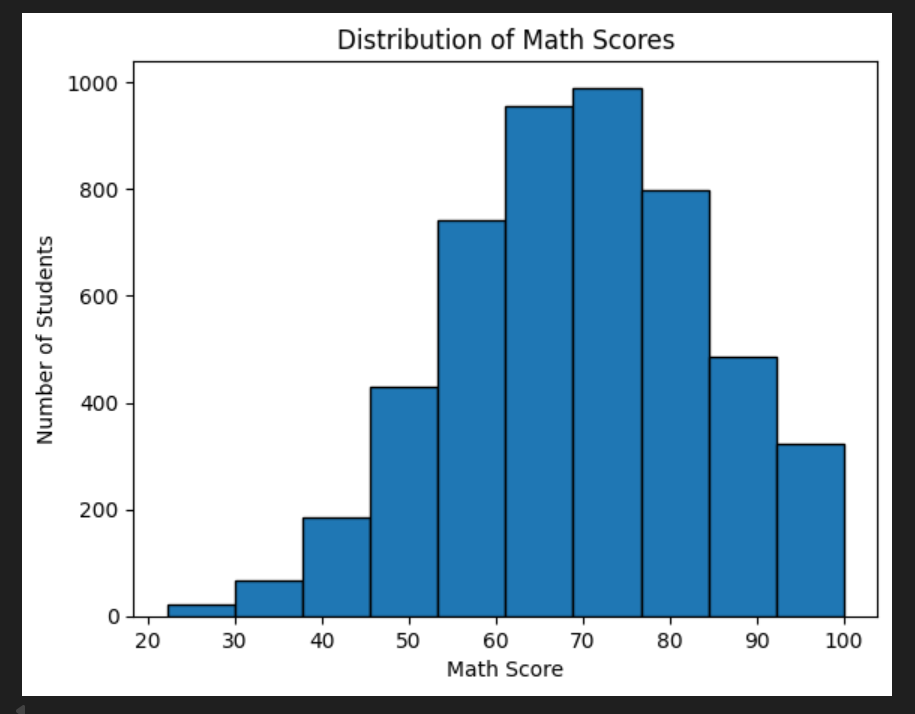

# 📘 README: Theory Notes  

## 📊 Overview  
This document contains **theory notes** on fundamental statistical concepts. It explains **mean, median, mode, variance, standard deviation, probability, skewness, kurtosis, and Bayes theorem** 📐✨.  

These notes are designed to provide a **quick reference** for students 📚 and learners 💡 who want to revise key statistical concepts.

---

## 📸 Screenshot  

---

## 📈 Key Topics  

### 1️⃣ Measures of Central Tendency  
- **Mean ➕** → Average of all values  
- **Median 📏** → Middle value when data is ordered  
- **Mode 🔄** → Most frequently occurring value  

👉 Example:  
- Mean = 24K  
- Median = 22K  
- Mode = 22K  

---

### 2️⃣ Variance & Standard Deviation  
- **Variance (σ²) 📦** → Average squared deviation from mean  
- **Standard Deviation (σ) 📉** → Square root of variance  

👉 Example: Monthly Salaries: 20K, 22K, 22K, 25K, 60K  

---

### 3️⃣ Probability & Normal Distribution  
- **Normal Distribution 📊** → Symmetrical distribution (bell-shaped)  
- **Use Case 🎯** → Student test scores, real-life data fitting  

---

### 4️⃣ Skewness & Kurtosis  
- **Skewness ↔️** → Measure of data asymmetry  
- **Kurtosis ⛰️** → Measure of data’s peakness (flat vs sharp)  

---

### 5️⃣ Probability Basics  
- **Independent & Dependent Events 🎲**  
- **Empirical Probability 🔍** → Based on experiments  
- **Theoretical Probability 📘** → Based on formulas  

---

### 6️⃣ Bayes’ Theorem  
- Helps **update probability** when new evidence 📡 is introduced  
- Example: Probability of someone being sick 🤒 given symptoms like cough  

---

### 7️⃣ Eigenvalue & Eigenvector (Linear Algebra 🌐)  
- **Eigenvalue (λ) 🔑** → Factor by which vector is stretched  
- **Eigenvector ➡️** → Vector whose direction does not change under transformation  

---

## ✅ Usage  
- Perfect for **exam revision 📝**  
- Quick **reference guide 📚**  
- Great for **conceptual clarity 💡**  

---

## 🎯 Conclusion  
This file is a **compact theory handbook 📒✨** covering the most important **statistics and probability concepts**. Useful for students 🎓, analysts 📊, and researchers 🔬.  

---